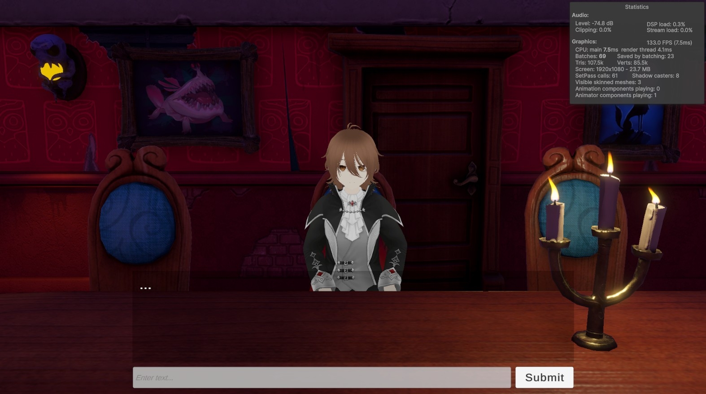
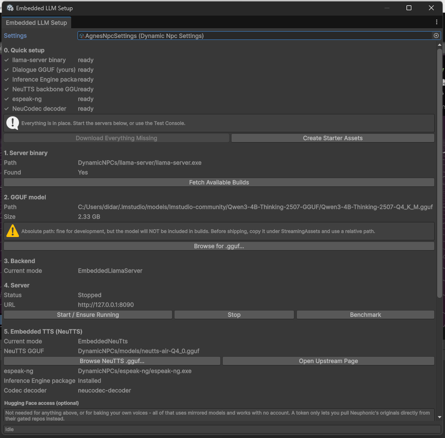
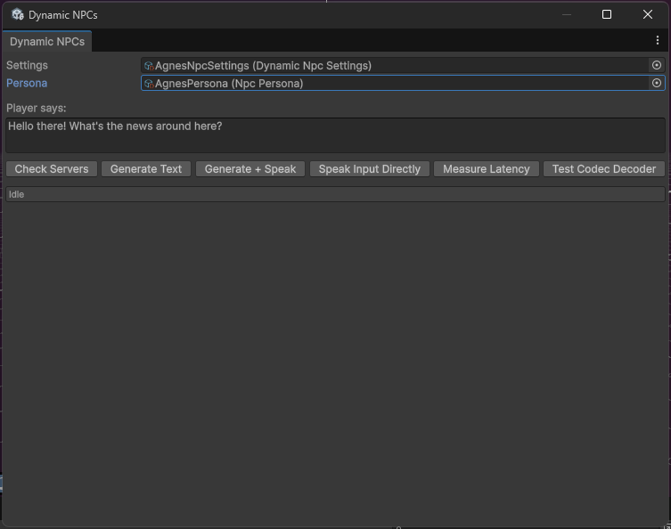
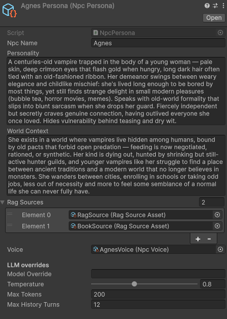

# Dynamic NPCs — AI Character Showcase

A Unity package for building **fully local, offline AI companions and NPCs** — a complete LLM + retrieval-augmented generation (RAG) + neural text-to-speech + character-animation pipeline that runs entirely on-device, with no cloud service, no API key, and no recurring cost.

Built as part of an M.Sc. thesis in Data Science at Università degli Studi di Milano-Bicocca, comparing this local pipeline against Convai, a leading commercial cloud platform, across latency, dialogue quality, voice quality, and knowledge-base capacity.

> ⚠️ **Demo assets note:** this repository includes the package *and* a reference demo scene. The demo scene's character model (VRoid Studio, imported via [UniVRM](https://github.com/vrm-c/UniVRM)) and animations (Mixamo).

---

## ✨ Features

- **100% local inference, zero recurring cost.** A quantized LLM (Qwen3-4B-Thinking-2507, Q4_K_M, ~2.3 GB) runs via a bundled `llama.cpp` server that the package launches and manages itself — no Ollama, no Python, no manual setup required by the end player.
- **Retrieval-augmented generation, built from scratch.** A hybrid retriever combines semantic (embedding) search with a self-implemented Okapi BM25 ranking, fused via Reciprocal Rank Fusion — not a wrapper around a third-party RAG library.
- **Neural text-to-speech with voice cloning.** Powered by NeuTTS, which treats speech synthesis as a language-modeling problem (reusing the same `llama-server` infrastructure as dialogue) and decodes the result in-engine via Unity's Inference Engine (Sentis) — no external TTS process, no cloud TTS API.
- **Streaming dialogue pipeline.** The character starts speaking the first sentence of its reply while the rest is still being generated, instead of waiting for the full response.
- **No-code character authoring.** A new NPC — its personality, voice, and knowledge base — is defined entirely through Unity ScriptableObject assets (`NpcPersona`, `NpcVoice`, `RagSourceAsset`), editable from the Inspector.
- **Full Editor tooling.** An in-Editor Setup Wizard downloads the required binaries and models, a Test Console exercises the whole pipeline without entering Play Mode, and dedicated bakers precompute RAG indices and voice reference data offline.
- **Cross-platform by design.** Validated on desktop and on desktop-tethered VR (Meta Quest 3S). Fully standalone VR/AR is a known, documented limitation — see [Limitations](#-known-limitations) below.

## 🖼️ Screenshots

| Reference demo scene | Embedded Server Setup |
|---|---|
|  |  |

| Test Console | Character configuration (no code) |
|---|---|
|  |  |

*(Drop the corresponding image files into `docs/images/` — see [Adding the screenshots](#adding-the-screenshots) below.)*

## 🏗️ Architecture

```
NPCDialogueAgent  (central orchestrator — exposes events only, no direct
                    dependency on UI/animation)
    │
    ├── LLM layer        LlmClient (OpenAI-compatible) + EmbeddedLlmServer /
    │                     LlamaServerHost (launches & supervises llama-server
    │                     as a managed child process)
    │
    ├── RAG layer         RagRetriever — hybrid semantic + BM25 search,
    │                     fused with Reciprocal Rank Fusion; indices are
    │                     baked offline in the Editor, never at runtime
    │
    ├── TTS layer         SpeechSynthesizer → NeuTtsClient (speech-as-
    │                     language-modeling via llama-server) → in-engine
    │                     NeuCodec decoder (ONNX via Sentis)
    │
    └── UnityEvents  →   NPCAnimController (Idle / Thinking / Talking state
                          machine), subtitle UI, or any other presentation
                          layer — fully decoupled from the backend in use
```

Configuration is entirely data-driven: `DynamicNpcSettings` (global connection/runtime settings), `NpcPersona` (personality, world context, attached RAG sources), `NpcVoice` (cloneable voice + baked reference codes), and `RagSourceAsset` (one knowledge source + its chunking parameters).

## 🚀 Getting Started

1. **Clone the repository** and open it in Unity.
2. Open **Window → Dynamic NPCs → Embedded Server Setup**.
3. Click **Download Everything Missing**, then **Create Starter Assets**. This fetches the `llama-server` binary, the dialogue GGUF model, the NeuTTS backbone and NeuCodec decoder, and `espeak-ng`.
4. Open the demo scene and press **Play**. Type a line into the input field and press **Submit**.

> **Platform note:** the bundled binaries currently used in development are Windows builds (`llama-server.exe`, `espeak-ng.exe`). If you need macOS/Linux support, you'll need to source or build compatible binaries for those platforms.

### Creating your own character

1. Create a new `NpcPersona` asset (Create → Dynamic NPCs → Persona) and fill in its name, personality, and world context.
2. Create an `NpcVoice` asset from a short (10–20s) reference audio sample and transcript, then bake it via the Voice Baker (requires a local Python environment, provisioned automatically).
3. (Optional) Create one or more `RagSourceAsset`s pointing at your own text files, set a chunk size/overlap, and bake the index via the RAG Baker.
4. Assign your `NpcPersona` to an `NPCDialogueAgent` in your scene and you're done — no code required.

## 📁 Project Structure

```
Assets/
├── Scripts/
│   ├── NPCDialogueAgent.cs       # central orchestrator
│   ├── NPCAnimController.cs      # reference animation/presentation layer
│   ├── Runtime/
│   │   ├── Llm/                  # LlmClient, EmbeddedLlmServer, LlamaServerHost
│   │   ├── Rag/                  # RagRetriever, RagBm25Index, RagSourceAsset
│   │   ├── Tts/                  # SpeechSynthesizer, NeuTtsClient, NeuCodecDecoder
│   │   ├── Config/                # DynamicNpcSettings, NpcPersona, NpcVoice
│   │   └── Internal/              # SentenceChunker, WavUtility, SseDownloadHandler, ...
│   ├── Editor/                   # Setup Wizard, Test Console, bakers, diagnostics
│   └── Tools/                    # Python voice-baking script (dev-machine only)
└── ...
```

## ⚖️ Comparison: Local vs. Convai

As part of the accompanying thesis, this pipeline was compared against [Convai](https://www.convai.com/), a commercial cloud-hosted conversational AI platform. Summary of findings:

| | This project (local) | Convai (cloud) |
|---|---|---|
| Latency | Comparable; faster on short exchanges, more variable on complex ones | Comparable; more consistent across question complexity |
| Voice quality | Judged more natural and expressive (subjective) | More monotone (subjective) |
| Knowledge base | No size limit (local, offline indexing) | 1 MB cap on Free tier; full feature gated behind Enterprise plan |
| Cost | One-time, offline | Subscription, usage-metered |
| Animation/lip-sync tooling | Basic (state-machine driven) | More polished out of the box |
| Standalone VR/AR | Not currently supported (see below) | Supported (cloud-mediated, no local inference needed) |

*(Full methodology and results in the thesis.)*

## ⚠️ Known Limitations

- **Standalone VR/AR is not currently supported.** The embedded pipeline launches `llama-server` as a child process via `System.Diagnostics.Process`, which does not work on Android (the platform Meta Quest's OS is built on). A `RemoteServer` configuration — pointing a standalone build at a `llama-server` instance running elsewhere on the local network — should work in principle (it only requires `UnityWebRequest`, which *is* supported on Android) but has not yet been implemented or tested.
- **Text input only.** There is no speech-to-text; the player types to the character. This was a deliberate scope decision, not a technical blocker.
- **No fine-tuning.** The package deploys an existing, instruction-tuned model as-is and relies on RAG for domain adaptation — by design, so that using the package requires no training step or ML expertise.
- **Single-author evaluation.** The Convai comparison above is a hands-on pilot study, not a blind or statistically validated experiment.

## 🙏 Acknowledgements / Third-Party Components

- [llama.cpp](https://github.com/ggerganov/llama.cpp) — local LLM inference engine
- [Qwen3](https://github.com/QwenLM/Qwen3) (Alibaba) — dialogue model, Apache 2.0
- [NeuTTS / NeuCodec](https://github.com/neuphonic/neutts-air) (Neuphonic) — neural TTS and audio codec, Apache 2.0
- [espeak-ng](https://github.com/espeak-ng/espeak-ng) — phonemization
- [UniVRM](https://github.com/vrm-c/UniVRM) — VRM character import (demo scene only)
- Character model authored in [VRoid Studio](https://vroid.com/en/studio); animations from [Mixamo](https://www.mixamo.com/) (demo scene only)
